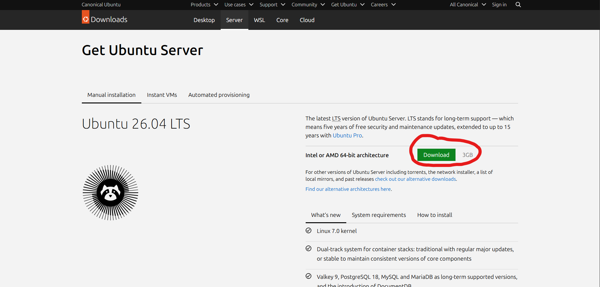
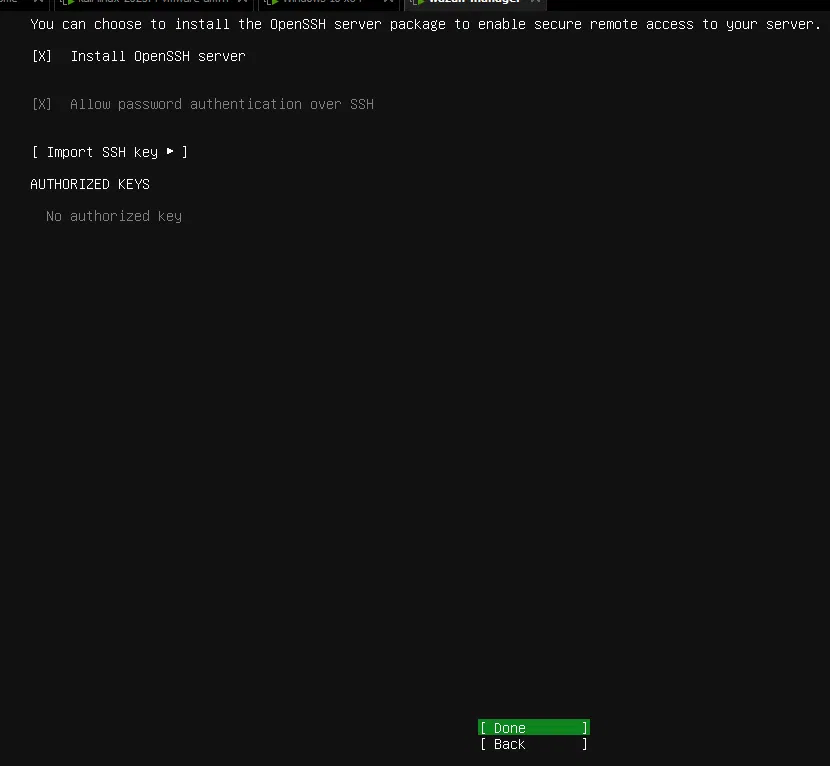
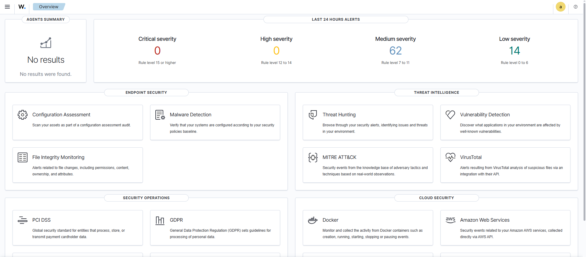
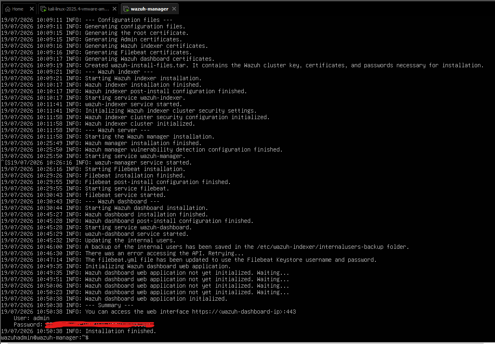

# Phase 2 — Wazuh Manager Installation

## Goal

Deploy a fully working Wazuh Manager (Indexer + Manager + Dashboard) on Ubuntu Server, to act as the central SIEM for the lab. This is the foundation every other phase builds on.

## Prerequisites

- VMware Workstation Pro
- Ubuntu Server ISO (26.04 LTS) https://ubuntu.com/download/server
- Host machine with at least 16GB RAM (to comfortably run multiple VMs)



## Environment Setup

- **VM name:** `wazuh-manager`
- **Allocated resources:** 4GB RAM, 2 CPU cores, 50GB disk
- **Network mode:** NAT
- **OS:** Ubuntu Server 26.04 LTS, with OpenSSH server installed during setup for remote administration



## Installation Steps

1. Installed Ubuntu Server via the standard guided installer (entire disk, LVM, OpenSSH enabled)
2. Verified network connectivity and identified the VM's IP address using `ip a`
3. Connected remotely via SSH from the host machine for easier command entry:
   ```bash
   ssh wazuhadmin@<vm-ip>
   ```
4. Updated the system:
   ```bash
   sudo apt update && sudo apt upgrade -y
   ```
5. Downloaded and ran the official Wazuh all-in-one installer:
   ```bash
   curl -sO https://packages.wazuh.com/4.9/wazuh-install.sh
   sudo bash ./wazuh-install.sh -a
   ```
6. On completion, retrieved the auto-generated dashboard admin credentials from the installer's summary output
7. Logged into the Wazuh Dashboard at `https://<wazuh-manager-ip>` to confirm the deployment

## Challenges & Troubleshooting

Real installs rarely go perfectly on the first try — here's what actually happened and how I resolved it:

**1. Leftover `cdrom` APT source causing update errors**
After a fresh install, `apt update` threw a repository error referencing the installation disc. Found the source of the issue with:
```bash
grep -r "cdrom" /etc/apt/sources.list.d/ /etc/apt/sources.list
```
Resolved by removing the stale source file:
```bash
sudo rm /etc/apt/sources.list.d/cdrom.sources
```

**2. Hardware requirements check failing**
The Wazuh installer flagged that my VM didn't meet its recommended minimum specs, even though it was allocated 4GB RAM / 2 cores. Bypassed the check (safe for a lab environment) using the `-i` flag:
```bash
sudo bash ./wazuh-install.sh -a -i
```

**3. Wazuh Indexer installation failed on first attempt**
The installer failed partway through the Indexer setup stage after a long run time, with no detailed error in the main install log. Investigated using:
```bash
sudo grep -i error /var/log/wazuh-install.log
sysctl vm.max_map_count
free -h
df -h /
```
Ruled out memory, disk space, and the common `vm.max_map_count` misconfiguration as causes — all were within acceptable ranges. Given the long stall before failure, suspected a transient network interruption during package download. Re-ran the installer, and the Indexer stage completed successfully in a fraction of the time (~5 minutes vs. a 16-minute stall before failure), confirming it was network-related rather than a configuration issue.

**4. Wazuh Manager installation failed on a subsequent attempt**
Similar pattern — the Manager stage failed after a long run, while the Indexer stage (already fixed) succeeded consistently. Applied the same fix: re-ran the full installer. The Manager stage completed successfully on retry.

**Key takeaway:** Rather than immediately assuming a configuration or resource problem, I used service logs, `journalctl`, and system resource checks to rule out the likely causes methodically before concluding the failures were transient network issues — then verified that conclusion by observing consistently faster, successful completions on retry.

## Result

- Wazuh Manager, Indexer, and Dashboard all installed and running
- Dashboard accessible at `https://<my ip address>` and logging in successfully with admin credentials
- Confirmed via the dashboard's "Agents Summary" panel showing zero connected agents (expected, since no agents have been deployed yet)

## Screenshots




<!-- *(Add redacted screenshots here — dashboard login screen and the Overview page. Do not include screenshots showing the plaintext admin password.)* -->

## Next Phase

[Phase 3 — Connecting the first Ubuntu monitored endpoint →](02-phase3-agent-setup.md)
