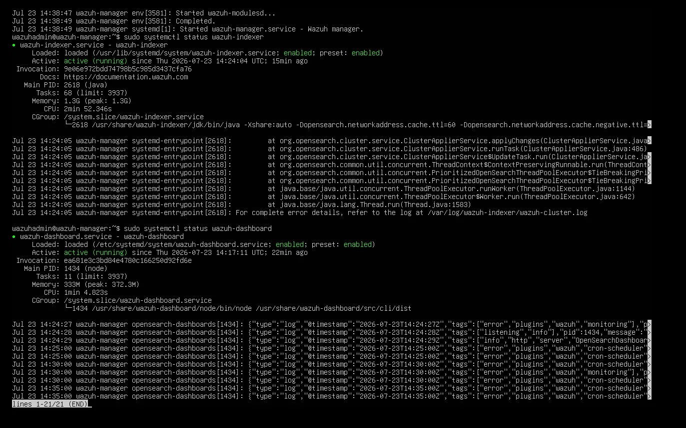
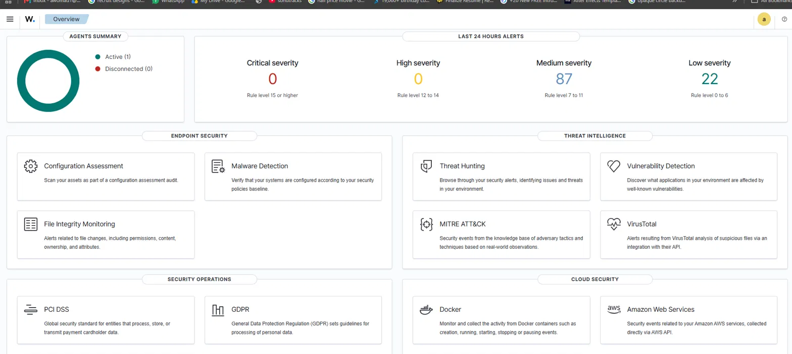
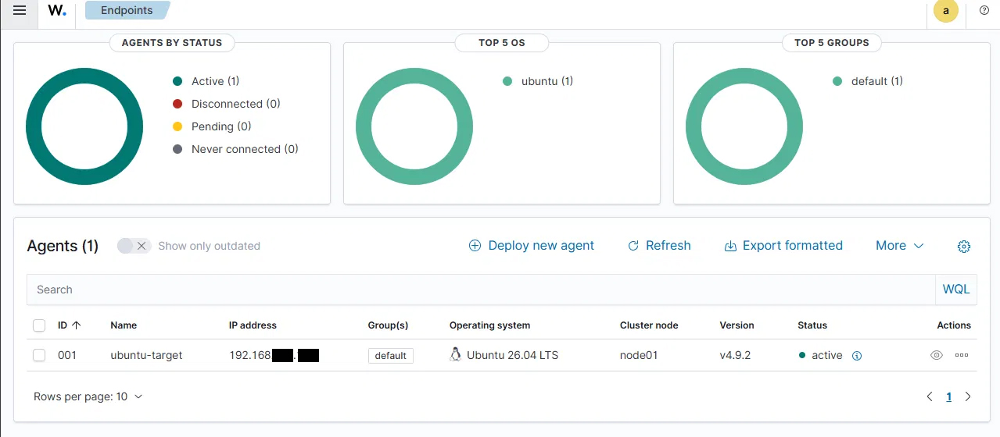

# Phase 3 — Ubuntu Agent Setup & Connection

## What I Built

A second Ubuntu Server VM (`ubuntu-target`) configured as a monitored endpoint, with the Wazuh Agent installed and connected back to the Wazuh Manager deployed in Phase 2. This is the first "protected machine" in the lab, the point where the SIEM stops being an empty dashboard and starts actually monitoring something.

## Why This Matters

A SIEM with no agents reporting to it is just an empty database. Connecting an agent is what turns Wazuh into an actual monitoring system — logs, file integrity checks, and process activity from `ubuntu-target` now flow into the Manager for analysis. This is the same relationship a SOC analyst works with daily: endpoints reporting up to a central console for triage.

## Environment

- **Host platform:** VMware Workstation
- **Guest OS:** Ubuntu Server (`ubuntu-target`)
- **Network mode:** NAT (same network as the Wazuh Manager, so they can reach each other)
- **Agent version:** Wazuh Agent 4.9.0

## Steps Taken

1. Provisioned a second Ubuntu Server VM (`ubuntu-target`) — 2GB RAM, 100GB disk, OpenSSH server enabled at install
2. Confirmed network connectivity to the Wazuh Manager VM with a `ping` test before attempting the agent install
3. Downloaded the Wazuh Agent `.deb` package and installed it, pointing it at the Wazuh Manager's IP via the `WAZUH_MANAGER` environment variable
4. Enabled and started the `wazuh-agent` service via `systemctl`
5. Checked the Wazuh Dashboard's **Endpoints Summary** page to confirm the agent appeared and was reporting as **Active**
6. Verified the connection was genuinely stable (not a brief flicker) by checking service status again after over an hour of uptime

## Challenges & How I Solved Them

- **First install attempt hit a corrupted `.deb` download.** Rather than assuming the install process itself was broken, I isolated the problem to the downloaded file and re-fetched it before retrying — the same "check the specific failure point before reinstalling everything" approach used in Phase 2.
- **Agent showed as connected before I could fully confirm the fix worked.** Rather than taking "Active" at face value, I ran a direct service status check on `ubuntu-target` itself:
  ```bash
  sudo systemctl status wazuh-agent
  ```
  This confirmed `active (running)` with all key sub-processes healthy — `wazuh-execd`, `wazuh-agentd`, `wazuh-syscheckd`, `wazuh-logcollector`, and `wazuh-modulesd` — after over an hour of uptime, ruling out a stale or flickering connection.

  

## Result

`ubuntu-target` is confirmed as a stable, actively reporting Wazuh agent:

| Field | Value |
|---|---|
| Agent ID | 001 |
| Name | ubuntu-target |
| IP | 192.168.xxx.xxx |
| OS | Ubuntu 26.04 LTS |
| Status | ✅ active |

The lab now has its first genuinely monitored endpoint, with logs and system activity flowing into the Wazuh Manager for analysis.

## Screenshots




- Endpoints Summary dashboard showing `ubuntu-target` as Active
- Terminal output of `systemctl status wazuh-agent` confirming a healthy, running service

## Next Phase

[Phase 4 — Windows Agent Setup](03-phase4-windows-agent.md) *(coming soon)*
